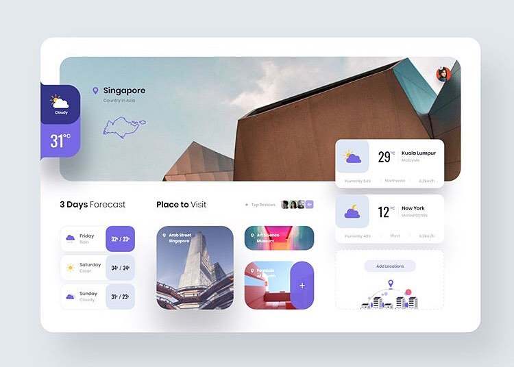
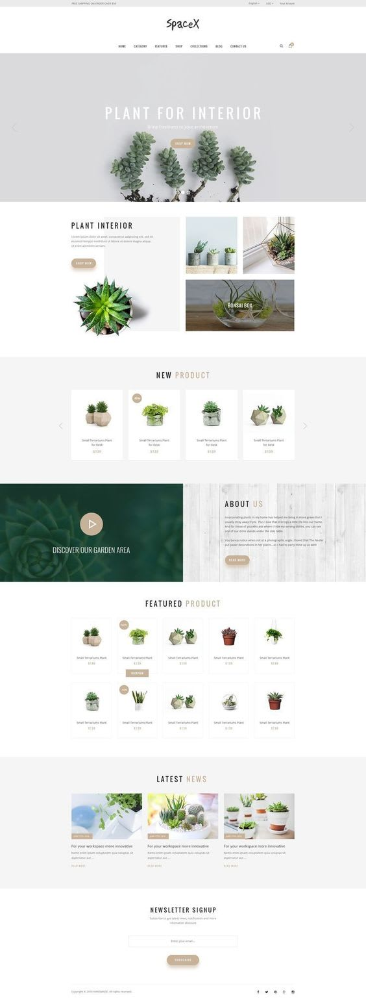
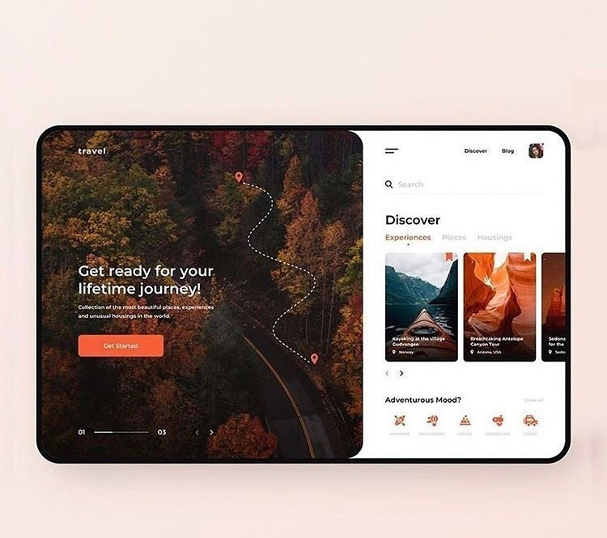

# ecovision

საიტზე როგორც ვისაუბრეთ, ჯობია იყოს მეტი ცარიელი სივრცე, რო ზედმეტად არ დაიტვირთოს და ვიზუალიც ბევრად უკეთესი გამოვა ზოგადად. აქ ნახავთ მაგალითებს (სამწუხაროდ უფრო უკეთესი ხარისხით ვერ ვნახე ეს კონკრეტული მაგალითები) რომელიც ზუსტად ერთიერთში არ იქნება გადმოტანილი უბრალოდ კარგი ელემენტები აქ და ნიუანსები რისი ჩვენთან გადმოტანაც შეგვიძლია და საერთო ჯამში კარგი საიტი გამოვა სადაც ადამიანს ესიამოვნება შესვლა. მე მაგალითად ესეთი საიტი რო გქონდეთ შემოვალ ხოლმე.

ამ მაგალითში მომწონს პირველი კომპონენტი, სურათი სადაც მცირე ტექსტის დამატებაც კარგი იქნებოდა და ეს სურათები შეგვიძლია ავტომატურად შეიცვალოს საბოლოო დიზაინში როგორც ჩაჯდება. ქვევით პარატა კომპონენტები ნიუსებისთვის რომ გამოვიყენოთ ჩემი აზრით ძალიან კარგად ჩაჯდება და არც დატვირთავს საიტს, მაგრამ აუცილებელი არაა ესე ახლოს იყოს შეგვიძლია ქვევითაც დავდოთ "ჩვენს შესახებ"-ის და "პროექტები"-ს ქვევით.

ამ მაგალითშიც კარგი კომპონენტებია და საიტის ზოგადი წყობა მომწონს, ისეა განლაგებული დაახლოებით როგორ პრიორიტეტებსაც შეხვედრაზე ვამბობდით და სურათებიც, პროექტებიც და ნიუსებიც კარგად ჩაჯდება.

ეს შედარებით განსხვავებული საიტია ჰორიზონტალური სქროლით. შეგვიძლია გავაკეთოთ მთავარი სურათი და ტექსტი ესე და მარჯვნივ მნიშვნელოვანი ნიუსები და პროექტები მოდიოდეს და მებისმიერ კომპონენტზე დაკლიკებით მარჯვენა მხარე გამოვა მარცხნივ. ესეთი ანიმაციის გაკეთებაც შეგვიძლია. 

ქვევით მოცემულია მაგალითები ლინკებით:

https://codepen.io/studiojvla/full/qVbQqW - მე პარტნიორებზე რო ვთქვი შეხვედრაზე ესეთ რამეს ვგილისხმობდი დაახლოებით. შეგვიძლია საიტის ბოლოში ან შუაში როგორც ჩაჯდება ჩავსვათ.

https://codepen.io/JavaScriptJunkie/full/WgRBxw - მნიშვნელოვანი ნიუსების ან ანონსის სლაიდერი ესეც შეიძლება რომ გაკეთდეს დაახლოებით.

ზოგადად შეგვიძლია სადმე თემფლეითების საიტზე ავარჩიოთ და გადმოვწეროთ თემფლეითი, მაგრამ ესეთი სტილის ვერ ვნახე ვერსად და თან ეკოვიზიაზე ბევრი ინფორმაციაა, ნიუსები მაგალითად და პროექტები და მგონია რო ესეთი უფრო კარგი და განსხვავებული გამოვა და თან კარგად ჩაჯდება ყველაფერი ერთმანეთში.